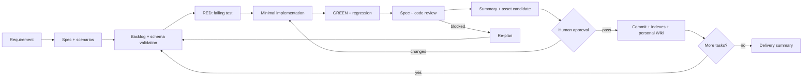

# Hepha

<p align="center">
  
</p>

<p align="center">
  <a href="./README.md">English</a> | <a href="./README.zh-CN.md">中文</a>
</p>

<p align="center">

[](https://github.com/melonlee/Hepha/stargazers)
[](https://opensource.org/licenses/MIT)
[](https://docs.claude.com/claude-code)
[](https://clawhub.ai/melonlee/hepha-skill)

</p>

<p align="center">
  <strong>Turn large requirements into small, safe, continuously shippable tasks — with an evidence trail that becomes reusable personal engineering knowledge.</strong>
</p>

<p align="center">

[Features](#features) · [Quick Start](#quick-start) · [How It Works](#how-it-works) · [Personal Wiki](#personal-wiki-and-asset-data) · [Local Review](#local-review-html) · [Documentation](#documentation)

</p>

---

## Why Hepha?

Hepha treats an AI coding skill as an executable engineering protocol, not a suggestion. It combines the Spec-driven and TDD discipline popularized by Superpowers with a local, searchable knowledge layer inspired by Hepha's original goals: content creation, collaboration, knowledge capture, retrieval, and one workspace.

Every task follows:

`SPEC → PLAN → RESEARCH → RED → GREEN → REGRESSION → REVIEW → SUMMARY → WIKI → COMMIT`

The Markdown files are the human reading layer. JSON is the machine fact source used by gates, indexes, and the local review UI.

### What you get

- One ready task per loop, with explicit Given/When/Then acceptance criteria.
- Real RED, GREEN, and regression evidence for behavior changes.
- Separate Spec and code reviews, plus explicit human approval by default.
- A dated Summary for what happened and a Wiki asset for what can be reused.
- A project index and a cross-project personal Wiki under `~/.hepha/wiki`.
- A dependency-free local HTML review page with search and provenance.

## Features

| Feature | What it does |
|---------|-------------|
| **Spec + executable schema** | Validates Specs, task fields, dependency DAGs, state transitions, test plans, and asset policy. |
| **TDD gates** | Requires a real failing RED run, a passing GREEN run, and a passing regression run. |
| **Contract fingerprint** | Prevents changing acceptance, tests, Spec references, or asset policy after execution starts. |
| **Two-layer control** | `SKILL.md` orchestrates strategy; `rules/hepha-guard.mdc` enforces hard stops. |
| **Summary archive** | Writes `.hepha/summary/YYYY-MM-DD/<person>/TASK-XXX.md` for human and AI review. |
| **Personal Wiki** | Promotes reviewed candidates into reusable decisions, patterns, recipes, checklists, and troubleshooting notes. |
| **Cross-project index** | Syncs non-confidential published assets to `~/.hepha/wiki/index.json` with provenance and metrics. |
| **Local Review HTML** | Renders timeline, task evidence, Wiki cards, candidate queue, search, and Spec → Task → Test → Commit lineage. |

## Quick Start

```bash
# 1. Install the skill for Codex (the user-level directory supports symlinks)
mkdir -p ~/.agents/skills
ln -s "$(pwd)/skills/hepha" ~/.agents/skills/hepha

# 2. Initialize the machine-readable project workspace
node ~/.agents/skills/hepha/scripts/hepha-cli.js init --root . --requirement "<one-line requirement>"

# 3. Tell Codex to run the protocol
Enable hepha mode.
Use Chinese for task records and summaries.
Run: spec -> plan -> research -> TDD -> review -> summary -> wiki -> commit.
Continue until the backlog is complete.
Requirement: <paste your requirement here>

# 4. Validate, sync personal assets, and start the read-only review page
node ~/.agents/skills/hepha/scripts/hepha-cli.js validate --root .
node ~/.agents/skills/hepha/scripts/hepha-cli.js sync-personal --root .
node ~/.agents/skills/hepha/scripts/hepha-server.js --root . --port 3000
```

The default personal Wiki location is `~/.hepha/wiki`. Use `--wiki-root` or `HEPHA_WIKI_ROOT` when a different location is needed.

## How It Works



### The loop

1. **Spec and plan** — Define goals, non-goals, constraints, scenarios, and Definition of Done. Tasks reference stable Spec scenario IDs.
2. **Research** — Research only for a new tool, architecture change, security/migration risk, or a real multi-option decision. Record trade-offs in `decision-log.md`.
3. **TDD** — Record commands, exit codes, and output summaries in `.hepha/evidence/TASK-XXX.json`.
4. **Review** — Run Spec review and code review independently. UI or flow changes also require browser evidence.
5. **Summary and Wiki** — Write the factual task Summary first. Extract only stable, reusable conclusions into a candidate asset; redact secrets and project-confidential details.
6. **Commit** — A task may become `done` only after evidence, reviews, Summary, asset policy, and approval gates pass. Use `source_commits: [self]` before the task commit; sync resolves it to the real hash afterward.

## Personal Wiki and Asset Data

The key distinction is intentional:

| Layer | Question answered | Retention |
|------|-------------------|-----------|
| Evidence | What was tested or reviewed? | Per task, immutable record |
| Summary | What happened in this delivery loop? | Dated project history |
| Wiki asset | What should I reuse next time? | Long-lived personal knowledge |
| Personal index | Where, how often, and with what provenance can I find it? | Cross-project query layer |

The asset pipeline is:

```text
Spec + task + tests + reviews
        ↓
Summary (facts and evidence)
        ↓ deliberate extraction + sensitivity check
Wiki candidate (reusable conclusion)
        ↓ review and publish
Project Wiki asset (.hepha/wiki/assets/*.md)
        ↓ post-commit sync
Personal Wiki (~/.hepha/wiki/assets/<project-key>/*.md + index.json)
```

Asset frontmatter records the provenance needed to trust and reuse it:

```yaml
asset_id: PAT-001
type: pattern
status: published
tags: [tdd, api]
source_tasks: [TASK-004]
source_specs: [SPEC-002]
source_tests: [tests/api.test.js]
source_commits: [<resolved git hash>]
confidence: verified
sensitivity: personal
```

Lifecycle: `candidate → reviewed → published → stale → superseded`. Supported types include `decision`, `pattern`, `recipe`, `checklist`, `troubleshooting`, `glossary`, `retrospective`, and `project-map`. `project-confidential` assets never enter the cross-project Wiki.

`index.json` is generated data, not hand-edited state. It contains searchable asset records plus metrics such as total assets, counts by status/type/project, top tags, and provenance completeness. This makes personal engineering capital measurable without treating file count as quality.

## Local Review HTML

Start the read-only server:

```bash
node ~/.agents/skills/hepha/scripts/hepha-server.js --root . --port 3000
```

Pages and capabilities:

- `/` — project overview, task timeline, artifact links, published assets, and candidate queue.
- `/task?file=...` — rendered Summary plus TDD/check rows, Spec/code/human review status, and linked Wiki assets.
- `/asset?scope=project&file=...` — asset content, metadata, and Spec → Task → Test → Commit lineage.
- `/search?q=...` — normalized full-text search across tasks, assets, tags, and source IDs.
- `/artifact?name=progress.md` — rendered backlog, progress, or decision log.

The server only accepts GET/HEAD, validates paths and symlinks, blocks executable links, and sends CSP, `X-Frame-Options`, and `nosniff` headers. The page is a review surface; `.hepha/backlog.json`, evidence JSON, and Wiki indexes remain the sources of truth.

## Runtime Artifacts

```text
.hepha/
├── manifest.json                         # requirement, owner, approval policy
├── backlog.json                          # machine fact source
├── backlog.md                            # generated reading view
├── specs/SPEC-XXX.md                     # behavior specification
├── evidence/TASK-XXX.json                # TDD, checks, reviews, browser evidence
├── summary/YYYY-MM-DD/<person>/TASK.md   # factual delivery record
├── wiki/candidates/*.md                  # reviewed candidates awaiting publish
├── wiki/assets/*.md                      # published project assets
├── wiki/index.json                       # project asset index + metrics
└── index.json                            # task and asset search index
```

## CLI Reference

```text
init             Create .hepha runtime directories and starter Spec
validate         Validate backlog schema, references, and dependency DAG
record-check     Execute and record RED/GREEN/regression/check evidence
record-review    Record Spec, code, or human review
transition       Enforce the task state machine and completion gates
publish-asset    Move a reviewed candidate into project Wiki assets
build-index      Rebuild project task and asset indexes
sync-personal    Aggregate published, non-confidential assets across projects
```

## Documentation

- [Skill definition](./skills/hepha/SKILL.md)
- [Runtime schema](./skills/hepha/references/runtime-schema.md)
- [Spec, TDD, and role isolation](./skills/hepha/references/spec-tdd-sdd.md)
- [Personal Wiki and asset lifecycle](./skills/hepha/references/personal-wiki.md)
- [Task decomposition patterns](./skills/hepha/references/decomposition-patterns.md)
- [Progress visualization](./skills/hepha/references/progress-template.md)
- [Quality gates](./skills/hepha/references/validation_quality-gates.md)

## Scope

Hepha is an autonomous coding execution protocol for evidence-driven, small-step delivery. It does not replace product decisions or act as a general external workflow scheduler.

## Changelog

### v2.0.0

- Added executable Spec/TDD/dual-review gates and task contract fingerprints.
- Added project Wiki candidates, publishing, cross-project personal sync, provenance, and metrics.
- Added local HTML timeline, task evidence, Wiki views, search, and lineage pages.
- Added Codex user-level installation metadata and automated runtime tests.

### v1.0.0

- Initial release with task decomposition, progress visualization, validation, and local summaries.

## License

MIT
