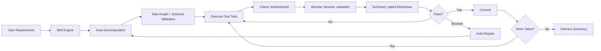

# Hepha

<p align="center">
  
</p>

<p align="center">
  <a href="./README.md">English</a> | <a href="./README.zh-CN.md">中文</a>
</p>

<p align="center">

[](https://github.com/melonlee/Hepha/stargazers)
[](https://opensource.org/licenses/MIT)
[](https://docs.claude.com/claude-code)
[](https://clawhub.ai/melonlee/hepha-skill)

</p>

<p align="center">
  <strong>Turn large requirements into small, safe, continuously shippable tasks — through autonomous iterative delivery loops.</strong>
</p>

<p align="center">

[Features](#features) · [Quick Start](#quick-start) · [How It Works](#how-it-works) · [Local Review](#local-review) · [Documentation](#documentation) · [Changelog](#changelog)

</p>

---

## ⭐ Why Hepha?

If you've ever spent hours specifying a feature, watching an AI agent go off the rails, and then spending more time fixing the chaos than writing the code — Hepha is for you.

Hepha forces a **disciplined loop**: PLAN → RESEARCH → EXECUTE → CHECK → REVIEW → SUMMARY → COMMIT. Every task is validated and recorded before the next task starts. Every commit is minimal and reviewable.

> **"Less talk, show me code. Leave a trail."** — Hepha's philosophy

### What you get

- 🚀 **Autonomous delivery** — One prompt, continuous commits until done
- 🛡️ **Risk-controlled** — Each loop ships one minimal, validated task
- 📊 **Visible progress** — Real-time task graph and progress bar
- 🔍 **Evidence-driven** — Every commit requires checks + browser review
- 🔄 **Self-correcting** — Auto-replans when blocked, asks only when truly necessary
- 📝 **Reviewable memory** — Each loop writes a dated task summary for humans and AI reviewers
- 🖥️ **Local review page** — Browse all `.hepha` summaries at `localhost:3000`

---

## Features

| Feature | What it does |
|---------|-------------|
| **Auto-Decomposition** | Breaks large requirements into validated task graphs with dependency tracking |
| **Schema Validation** | Forces complete task definitions with required fields (id, title, state, depends_on, acceptance, risk, files_hint) |
| **Research Decision Matrix** | Explicit rules: research only when truly needed (new lib, arch change, >2 options), skip for CRUD/bugfix/style |
| **Chinese-first Skill** | User-facing tasks, acceptance criteria, logs, decisions, and summaries are written in Chinese by default |
| **Task Summary Archive** | Each loop creates `.hepha/summary/YYYY-MM-DD/<person>/TASK-XXX.md` for human and AI review |
| **Local Review Server** | Runs a dependency-free Node server that renders backlog, progress, decisions, and task summaries |
| **Progress Visualization** | Live progress bars, status tables, and task dependency graphs in Markdown |
| **Two-layer Control** | `Skill` handles strategy; `Rule` enforces hard constraints and stop conditions |
| **Deterministic Stop Policy** | Stops on repeated failures or no executable tasks; reports blockers clearly |

---

## Quick Start

```bash
# 1. Clone or copy the skill into your Claude Code/OpenClaw skills directory
cp -r skills/hepha ~/.claude/skills/

# 2. Activate Hepha mode with a single prompt
Enable hepha mode.
Use Chinese for all task records and summaries.
Run loop: plan -> research -> execute -> check -> review -> summary -> commit.
Write each loop summary to .hepha/summary/YYYY-MM-DD/<person>/TASK-XXX.md.
Continue until backlog is complete.
Requirement: <paste your requirement here>

# 3. Browse summaries locally when needed
node ~/.claude/skills/hepha/scripts/hepha-server.js --root . --port 3000
```

That's it. Hepha will:
1. Analyze your requirement and auto-decompose it into a task graph
2. Execute one task at a time through the validated loop
3. Write a dated Markdown summary after each loop
4. Commit after each successful loop
5. Let you review all summaries at `http://localhost:3000`
6. Stop when all tasks are done or a stop condition is hit

---

## How It Works

<p align="center">
  
</p>



### The Loop: PLAN → RESEARCH → EXECUTE → CHECK → REVIEW → SUMMARY → COMMIT

#### 1. PLAN
- **Auto-Decomposition**: If no backlog exists, automatically break down requirements into tasks using patterns (CRUD, Authentication, UI Components, API Integration)
- **Schema Validation**: Every task must have: `id`, `title`, `state`, `depends_on`, `acceptance`, `risk`, `files_hint`
- **Select Task**: Pick from ready queue (all dependencies done)

#### 2. RESEARCH
Research is **ONLY** required for:
- ✅ New library/framework/tool
- ✅ Architecture changes
- ✅ Implementation uncertainty (>2 options)
- ❌ NOT for: CRUD, bug fixes, style changes

#### 3. EXECUTE
- Keep changes focused on required files only
- Avoid speculative refactors
- Keep functions small and reusable

#### 4. CHECK
Run all relevant project checks:
```
lint → tests → build/typecheck
```
Fix and retry until pass.

#### 5. REVIEW (For UI/flow changes)
Use MCP browser tools or Playwright to validate:
- Page load success
- Key interaction path works
- Expected state is visible

#### 6. SUMMARY
Every loop writes a standalone Markdown file:

```
.hepha/summary/YYYY-MM-DD/<person>/TASK-XXX.md
```

The summary includes the task goal, acceptance criteria, execution notes, changed files, check results, browser or manual review evidence, decisions, risks, follow-ups, and an AI reviewer quick-check section.

#### 7. COMMIT
Commit only when:
- ✅ checks passed
- ✅ review passed
- ✅ acceptance criteria met
- ✅ summary generated

---

## Workflow Demo

### Before & After

| Without Hepha | With Hepha |
|--------------|-----------|
| One big prompt, unpredictable output | One prompt, structured autonomous loops |
| No visibility into progress | Real-time task graph + progress bar |
| Large, risky commits | Small, validated commits after each loop |
| Goes off rails easily | Auto-replans when blocked |
| No evidence of quality | Every commit has check + review + summary evidence |

### Live Progress Example

```
总体进度：[████████░░] 80% (4/5 个任务完成)

状态汇总：
| 状态   | 数量 | 任务                         |
|--------|------|------------------------------|
| 已完成 | 4    | TASK-001, 002, 004, 005      |
| 进行中 | 1    | TASK-003                     |
| 待执行 | 0    | -                            |
| 阻塞   | 0    | -                            |

任务依赖图：
TASK-001 (done) --> TASK-002 (done) --> TASK-003 (doing)
     │
     └──────────────> TASK-004 (done)
```

### Usage Example

```bash
# Prompt:
Enable hepha mode.
Run autonomous loops until complete.
Requirement: Implement user authentication with JWT.
```

The skill will:
1. Auto-decompose into 4-6 tasks (e.g., TASK-001: DB schema, TASK-002: auth middleware, TASK-003: login API, TASK-004: frontend login form, TASK-005: JWT validation)
2. Execute each task through the validated loop
3. Generate a Chinese task summary for each loop
4. Commit after each successful loop
5. Stop when complete or blocked

---

## Project Structure

```
skills/hepha/
├── SKILL.md                           # Main skill definition (for Claude Code/OpenClaw)
├── references/                        # Documentation
│   ├── decomposition-patterns.md      # Task breakdown patterns
│   ├── planning_task-decomposition.md # Task schema reference
│   ├── progress-template.md           # Progress visualization guide
│   └── validation_quality-gates.md    # Quality gate definitions
├── scripts/
│   └── hepha-server.js                # Local summary browser
└── templates/                         # Runtime file templates
    ├── backlog.md                     # Task graph template
    ├── progress.md                    # Progress log template
    ├── decision-log.md                # Research log template
    └── task-summary.md                # Per-loop summary template
```

## Runtime Artifacts

Hepha creates and maintains these files in your project's `.hepha/` directory:

| File | Purpose |
|------|---------|
| `backlog.md` | Task graph with states, dependencies, and risk levels |
| `progress.md` | Per-loop execution log with evidence and progress visualization |
| `decision-log.md` | Research and technical decisions with trade-off analysis |
| `summary/YYYY-MM-DD/<person>/TASK-XXX.md` | Per-loop summary for human and AI review |

---

## Local Review

Start the review server from any project root:

```bash
node ~/.claude/skills/hepha/scripts/hepha-server.js --root . --port 3000
```

Open `http://localhost:3000` to browse:

- task summaries grouped by date and person
- `backlog.md`, `progress.md`, and `decision-log.md`
- individual Markdown summaries rendered in a Claude Code-inspired dark interface

The server has no npm dependencies and only reads files under the selected project's `.hepha/` directory.

---

## Technical Approach

- **Two-layer control model**
  - `Skill` handles strategy and execution orchestration
  - `Rule` enforces hard constraints and stop conditions
- **Small-batch delivery**: Each loop handles one minimal sub-task — no "big-bang" refactors
- **Evidence-driven quality**: Every loop includes verification output; commit only after `check + review` pass
- **Human + AI review memory**: Every loop produces a stable Markdown artifact for review, audit, and future context
- **Deterministic stop policy**: Stop after repeated failures or no executable tasks; report blockers and current state

### Design influence from Superpowers

Superpowers treats skills as mandatory engineering workflows rather than optional prompt suggestions. Its software-engineering flow moves from clarification and spec, to bite-sized implementation plans, to task execution, TDD, review, and completion. Hepha keeps that discipline but chooses a different product shape:

| Area | Superpowers | Hepha |
|------|-------------|-------|
| Unit of control | Many composable skills across the SDLC | One compact delivery skill plus a guard rule |
| Execution model | Spec → plan → subagent or batch execution → review | Backlog → one-loop task → check/review/summary → commit |
| Quality model | TDD, spec compliance review, code quality review | Checks, browser review, task summary, deterministic stop policy |
| Human surface | Plans and review checkpoints | `.hepha` artifacts plus local review page |
| Language | English-first | Chinese-first for user-facing records |

## Scope and Non-goals

- ✅ This is an **execution protocol** for autonomous coding
- ✅ Optimizes continuous delivery speed under controlled risk
- ❌ Does **NOT** replace product decisions when requirements conflict
- ❌ Is **NOT** a full external workflow scheduler

---

## Documentation

- [Skill Definition](./skills/hepha/SKILL.md)
- [Decomposition Patterns](./skills/hepha/references/decomposition-patterns.md)
- [Progress Visualization Guide](./skills/hepha/references/progress-template.md)
- [Quality Gates](./skills/hepha/references/validation_quality-gates.md)
- [ClawHub Listing](https://clawhub.ai/melonlee/hepha-skill)

---

## Changelog

### v1.1.0 (2026-05-30)
- Chinese-first skill instructions and runtime templates
- Per-loop task summaries under `.hepha/summary/YYYY-MM-DD/<person>/TASK-XXX.md`
- Local review server at `localhost:3000`
- Loop updated to PLAN → RESEARCH → EXECUTE → CHECK → REVIEW → SUMMARY → COMMIT
- Superpowers-inspired design comparison documented

### v1.0.0 (2026-03-28)
- Initial release
- Auto-decomposition with task graph generation
- PLAN → EXECUTE → CHECK → REVIEW → COMMIT loop
- Schema validation for all tasks
- Research decision matrix
- Progress visualization with Markdown bars and dependency graphs
- Runtime artifacts: backlog.md, progress.md, decision-log.md
- Dual language support (English + 中文)

---

## License

MIT

<p align="center">
  Hepha — Built for developers who believe in <strong>evidence over promises</strong>.
</p>
