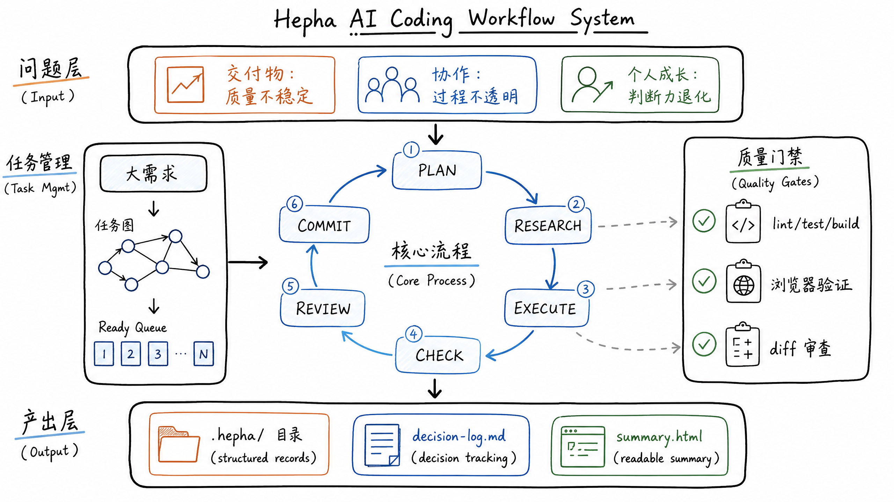
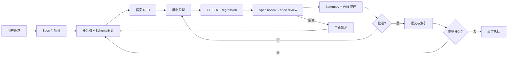

# Hepha

<p align="center">
  
</p>

<p align="center">
  <a href="./README.md">English</a> | <a href="./README.zh-CN.md">中文</a>
</p>

<p align="center">

[](https://github.com/melonlee/Hepha/stargazers)
[](https://opensource.org/licenses/MIT)
[](https://docs.claude.com/claude-code)
[](https://clawhub.ai/melonlee/hepha-skill)

</p>

<p align="center">
  <strong>通过自主迭代交付循环，将大需求拆解为小而安全、可持续交付的任务。</strong>
</p>

<p align="center">

[功能介绍](#功能介绍) · [快速开始](#快速开始) · [工作原理](#工作原理) · [个人 Wiki](#个人-wiki) · [本地-review](#本地-review) · [文档](#文档) · [更新日志](#更新日志)

</p>

---

## ⭐ 为什么用 Hepha？

如果你曾经试过给 AI Agent 一个大需求，然后看着它跑偏、产生一堆难以维护的代码，最后花的时间比手动写还多 — Hepha 就是为你设计的。

Hepha 强制执行**纪律严明的循环**：SPEC → PLAN → RESEARCH → TDD → REVIEW → SUMMARY → WIKI → COMMIT。每个任务在进入下一步前都要验证、审查并沉淀。每次提交都是最小化、可追溯的。

> **"少废话，看代码。每步都有记录。"** — Hepha 的信条

### 你将获得

- 🚀 **自主交付** — 一个提示词，持续提交直到完成
- 🛡️ **风险可控** — 每轮只交付一个最小、经过验证的任务
- 📊 **进度透明** — 实时任务图 + 进度条
- 🔍 **证据驱动** — 每次提交都必须通过检查 + 浏览器验证
- 🔄 **自我修正** — 被阻塞时自动重新规划，只在真正必要时才提问
- 📝 **可审查沉淀** — 每轮生成按日期和人物归档的任务 summary
- 🧠 **个人 Wiki** — 从已验证任务提炼可复用决策、模式、排障和清单
- 🖥️ **本地 review 页面** — 在 `localhost:3000` 检索任务、资产和来源谱系

---

## 功能介绍

| 功能 | 说明 |
|------|------|
| **自动拆解** | 将大需求自动拆解为带依赖关系的验证任务图 |
| **可执行 Schema** | 校验任务字段、Spec 引用、依赖 DAG、状态转换和 TDD 证据 |
| **Spec + TDD** | Given/When/Then 场景与真实 RED → GREEN → regression 门禁 |
| **研究决策矩阵** | 明确规则：只在真正需要时研究（新库、架构变更、多方案），CRUD/改Bug/样式调整不需要研究 |
| **中文优先 Skill** | 任务、验收、进度、决策和 summary 默认使用中文 |
| **任务 Summary 归档** | 每轮生成 `.hepha/summary/YYYY-MM-DD/<person>/TASK-XXX.md`，方便人和 AI review |
| **个人 Wiki 资产** | 候选 → 审核 → 发布 → 过期/替代，关联 Spec、Task、Test、Commit |
| **本地 Review 服务** | 无依赖 Node 服务，渲染任务、个人资产、全文搜索和来源谱系 |
| **进度可视化** | Markdown 进度条、状态表、任务依赖图，实时更新 |
| **双层控制** | `Skill` 负责策略编排；`Rule` 强制硬边界和停止条件 |
| **确定性停止策略** | 连续失败或无执行任务时自动停止；清晰报告阻塞点和当前状态 |

---

## 快速开始

```bash
# 1. 安装到 Codex 用户级目录（官方支持符号链接）
mkdir -p ~/.agents/skills
ln -s "$(pwd)/skills/hepha" ~/.agents/skills/hepha

# 2. 初始化当前项目的机器事实源
node ~/.agents/skills/hepha/scripts/hepha-cli.js init --root . --requirement "<一句话需求>"

# 3. 一个提示词激活 Hepha 模式
启用 hepha 模式。
所有任务、验收、进度和 summary 使用中文。
运行循环：spec -> plan -> research -> TDD -> review -> summary -> wiki -> commit。
每轮写入 .hepha/summary/YYYY-MM-DD/<person>/TASK-XXX.md，并维护个人 Wiki。
持续直到 backlog 完成。
需求：<在这里粘贴你的需求>

# 4. 校验、同步个人资产并启动本地 review 页面
node ~/.agents/skills/hepha/scripts/hepha-cli.js validate --root .
node ~/.agents/skills/hepha/scripts/hepha-cli.js sync-personal --root .
node ~/.agents/skills/hepha/scripts/hepha-server.js --root . --port 3000
```

就这样。Hepha 会：
1. 分析你的需求并自动拆解成任务图
2. 每次只执行一个任务，通过完整验证循环
3. 每轮生成按日期和人物归档的中文 summary
4. 从 Summary 提炼并发布可复用个人资产
5. 在 `http://localhost:3000` 展示任务、资产、搜索和谱系
6. 每次成功循环后按批准策略提交
7. 全部任务完成或触发停止条件时停止

---

## 工作原理

<p align="center">
  
</p>



### 循环流程：SPEC → PLAN → RESEARCH → TDD → REVIEW → SUMMARY → WIKI → COMMIT

#### 1. SPEC + PLAN
- 先写目标、非目标、约束、行为场景和 Definition of Done。
- 任务使用 Given/When/Then 验收条件，并引用 `spec_refs`。
- `.hepha/backlog.json` 是机器事实源，CLI 会校验字段、依赖 DAG 和状态机。
- 从就绪队列中一次选择一个任务。

#### 2. RESEARCH（研究）
**仅在以下情况需要研究**：
- ✅ 新库/框架/工具
- ✅ 架构变更
- ✅ 实现不确定（>2 个方案）
- ❌ 不需要：CRUD、Bug 修复、样式调整

#### 3. TDD EXECUTE（执行）
- 仅修改必需的文件
- 避免推测性重构
- 行为任务必须真实经历 RED → GREEN → regression，并保存命令、退出码和输出摘要

#### 4. CHECK（检查）
运行所有相关的项目检查：
```
lint → tests → build/typecheck
```
修复并重试直到通过。

#### 5. REVIEW（审查）
- Spec review 逐条核对场景和验收条件。
- Code review 检查 P0/P1 问题、边界、安全性、测试质量和无关改动。
- 针对 UI/流程变更，使用 MCP 浏览器工具或 Playwright 验证：
- 页面加载成功
- 关键交互路径正常
- 预期状态可见

#### 6. SUMMARY + WIKI（沉淀）
每轮写入一个独立 Markdown：

```
.hepha/summary/YYYY-MM-DD/<person>/TASK-XXX.md
```

Summary 记录本次事实；个人 Wiki 只保存经过审核的可复用结论。资产必须关联 Spec、Task、Test 和 Commit，并经过敏感信息检查。

资产生命周期为：`candidate → reviewed → published → stale → superseded`。

#### 7. COMMIT（提交）
仅在以下情况提交：
- ✅ 检查通过
- ✅ 审查通过
- ✅ 验收标准满足
- ✅ summary 已生成
- ✅ 个人资产策略已满足
- ✅ 默认人工批准已记录（无人值守需显式关闭）

---

## 效果演示

### 使用前后对比

| 不用 Hepha | 使用 Hepha |
|-----------|-----------|
| 一个大提示词，输出不可预测 | 一个提示词，结构化自主循环 |
| 进度不透明 | 实时任务图 + 进度条 |
| 大范围高风险提交 | 每轮小步提交，每次都经过验证 |
| 容易跑偏 | 被阻塞时自动重新规划 |
| 无质量证据 | 每次提交都有检查 + 审查 + summary 证据 |

### 实时进度示例

```
总体进度：[████████░░] 80% (4/5 个任务完成)

状态汇总：
| 状态   | 数量 | 任务                         |
|--------|------|------------------------------|
| 已完成 | 4    | TASK-001, 002, 004, 005      |
| 进行中 | 1    | TASK-003                     |
| 待执行 | 0    | -                            |
| 阻塞   | 0    | -                            |

任务依赖图：
TASK-001 (done) --> TASK-002 (done) --> TASK-003 (doing)
     │
     └──────────────> TASK-004 (done)
```

### 使用示例

```bash
# 提示词：
启用 hepha 模式。
运行自主循环直到完成。
需求：实现基于 JWT 的用户认证。
```

技能将：
1. 自动拆解为 4-6 个任务（如 TASK-001：数据库Schema、TASK-002：认证中间件、TASK-003：登录API、TASK-004：前端登录表单、TASK-005：JWT 验证）
2. 每个任务都通过验证循环执行
3. 每轮生成中文任务 summary
4. 每次成功循环后提交
5. 完成或阻塞时停止

---

## 项目结构

```
skills/hepha/
├── SKILL.md                           # 主技能定义
├── agents/openai.yaml                 # Codex UI 元数据
├── references/                        # 文档
│   ├── runtime-schema.md              # 机器事实源和状态机
│   ├── spec-tdd-sdd.md                # Spec、TDD、角色隔离
│   ├── personal-wiki.md               # 个人资产生命周期
│   └── validation_quality-gates.md    # 质量门槛定义
├── scripts/
│   ├── hepha-core.js                  # Schema、证据和资产核心逻辑
│   ├── hepha-cli.js                   # 初始化、门禁、发布和同步 CLI
│   └── hepha-server.js                # 本地任务/Wiki 浏览服务
└── templates/                         # 运行时文件模板
    ├── backlog.json                   # 任务事实源模板
    ├── backlog.md                     # 任务图阅读版
    ├── spec.md                        # Spec 模板
    ├── progress.md                    # 进度日志模板
    ├── task-summary.md                # 每轮 summary 模板
    └── wiki-asset.md                  # 个人资产模板
```

## 运行时产物

Hepha 在项目 `.hepha/` 目录中创建并维护以下文件：

| 文件 | 用途 |
|------|------|
| `manifest.json` | 需求、负责人、提交策略和 Schema 版本 |
| `backlog.json` | 任务、依赖、Spec 引用和机器状态事实源 |
| `backlog.md` | 由 JSON 生成的可读任务图 |
| `progress.md` | 每轮执行日志，含证据和进度可视化 |
| `evidence/TASK-XXX.json` | TDD、检查、审查和浏览器证据 |
| `specs/SPEC-XXX.md` | 需求规格、行为场景和完成条件 |
| `decision-log.md` | 研究和技术决策，含权衡分析 |
| `summary/YYYY-MM-DD/<person>/TASK-XXX.md` | 每轮任务 summary，供人和 AI review |
| `wiki/candidates/*.md` | 待审核的个人资产候选 |
| `wiki/assets/*.md` | 已发布的可复用个人资产 |
| `wiki/index.json` | 资产检索索引 |

## 个人 Wiki

这里有意区分四层产物：

| 层 | 回答的问题 | 保存位置 |
|---|---|---|
| Evidence | 测试和审查到底证明了什么？ | `.hepha/evidence/TASK-XXX.json` |
| Summary | 这一轮交付发生了什么？ | `.hepha/summary/YYYY-MM-DD/<person>/TASK-XXX.md` |
| Wiki 资产 | 下次可以直接复用什么？ | `.hepha/wiki/assets/*.md` |
| 个人索引 | 跨项目在哪里找到、来源是否完整？ | `~/.hepha/wiki/index.json` |

从过程到个人资产的实际数据流：

```text
Spec + Task + Test + Review
          ↓
Summary（事实和证据）
          ↓ 人工提炼、去敏和去项目化
Wiki candidate（可复用结论）
          ↓ 审核发布
项目 Wiki 资产（.hepha/wiki/assets/*.md）
          ↓ 提交后同步
个人 Wiki（~/.hepha/wiki/assets/<project-key>/*.md）
          ↓
index.json（检索记录 + 来源谱系 + 统计指标）
```

Summary 记录“这次做了什么”，个人 Wiki 记录“以后可以复用什么”。不要把每份 Summary 自动发布成资产；只有通过 TDD、双审查和敏感信息检查的稳定结论才能发布。

资产元数据至少包含 `source_specs`、`source_tasks`、`source_tests`、`source_commits` 四类来源。提交前用 `source_commits: [self]`，同步时自动解析成真实 Git hash。`index.json` 还会生成总数、按状态/类型/项目计数、热门标签和来源完整度，个人资产因此可以被度量而不是只按文件数量计算。

资产类型包括 `decision`、`pattern`、`recipe`、`checklist`、`troubleshooting`、`glossary`、`retrospective` 和 `project-map`。生命周期为：

```text
candidate → reviewed → published → stale → superseded
```

同步到跨项目个人 Wiki（默认 `~/.hepha/wiki`，可用 `HEPHA_WIKI_ROOT` 覆盖）：

```bash
node ~/.agents/skills/hepha/scripts/hepha-cli.js sync-personal --root .
```

---

## 本地 Review

在任意项目根目录启动：

```bash
node ~/.agents/skills/hepha/scripts/hepha-server.js --root . --port 3000
```

打开 `http://localhost:3000` 可以查看：

- 按日期和人物分组的任务 summary
- `backlog.md`、`progress.md` 和 `decision-log.md`
- 任务详情中的 TDD 检查、Spec/code/human review 和关联资产
- 个人 Wiki、候选资产和 Spec → Task → Test → Commit 来源谱系
- 全文搜索任务、资产、标签和来源
- Claude Code 风格深色界面渲染的具体 Markdown

常用页面：

- `/`：项目概览、任务时间线、资产卡片和候选队列
- `/task?file=...`：Summary、TDD/审查证据和关联 Wiki 资产
- `/asset?scope=project&file=...`：资产正文、元数据和来源谱系
- `/search?q=...`：任务、资产、标签和来源 ID 的全文检索

服务不需要 npm 依赖，只读取指定项目 `.hepha/` 目录下的文件。

---

## 技术方案

- **双层控制模型**
  - `Skill` 负责策略编排与执行驱动
  - `Rule` 强制硬边界、门禁和停止条件
- **小步快跑交付**：每轮只处理一个最小子任务，避免单轮大爆改导致风险失控
- **证据驱动质量**：每轮都要产出可验证结果；仅在 `check + review` 通过后允许提交
- **人和 AI 共用的审查记忆**：每轮生成稳定 Markdown 产物，并将可复用结论沉淀为个人 Wiki
- **任务契约防漂移**：进入执行后固化任务指纹，禁止通过修改验收或资产策略绕过门禁
- **默认人工批准**：无人值守必须在 manifest 中显式关闭 `approval_required`
- **确定性停止策略**：连续失败或无可执行任务时停止；报告阻塞点和当前状态

### 来自 Superpowers 的设计启发

Superpowers 把 skill 当成强制执行的软件工程工作流，而不是可有可无的提示词。它的软件工程路径强调先澄清和写 spec，再写细粒度计划，再执行任务、TDD、review 和收尾。Hepha 继承这种工程纪律，但产品形态不同：

| 维度 | Superpowers | Hepha |
|------|-------------|-------|
| 控制单元 | 多个可组合 skill 覆盖 SDLC | 一个紧凑交付 skill + 一条 guard rule |
| 执行模型 | spec → plan → 子任务执行 → review | spec → backlog → TDD → 双审查 → Wiki → commit |
| 质量模型 | TDD、spec 合规 review、代码质量 review | 可执行 Schema、TDD 证据、双审查、敏感信息门禁 |
| 人类入口 | 计划和 review 检查点 | `.hepha` 运行产物 + 本地任务/Wiki 页面 |
| 语言策略 | 英文优先 | 用户可读记录中文优先 |

## 适用边界

- ✅ 这是自主编码的**执行协议**
- ✅ 目标是"可控风险下的**持续交付速度**"
- ❌ 需求冲突时**不替代**产品决策
- ❌ **不是**完整的外部工作流调度器

---

## 文档

- [技能定义](./skills/hepha/SKILL.md)
- [运行时 Schema](./skills/hepha/references/runtime-schema.md)
- [Spec、TDD 与角色隔离](./skills/hepha/references/spec-tdd-sdd.md)
- [个人 Wiki 与资产生命周期](./skills/hepha/references/personal-wiki.md)
- [拆解模式](./skills/hepha/references/decomposition-patterns.md)
- [进度可视化指南](./skills/hepha/references/progress-template.md)
- [质量门槛](./skills/hepha/references/validation_quality-gates.md)
- [ClaWHub 主页](https://clawhub.ai/melonlee/hepha-skill)

---

## 更新日志

### v2.0.0 (2026-09-09)
- 新增可执行 Spec/TDD/双审查门禁和任务契约指纹
- 新增个人 Wiki 候选、发布、跨项目同步、来源谱系和统计指标
- 本地 HTML 增加任务证据、资产搜索、详情和来源谱系页面
- 增加 Codex 用户级安装元数据和自动化运行时测试

### v1.1.0 (2026-05-30)
- Skill 指令和运行模板改为中文优先
- 每轮任务 summary 写入 `.hepha/summary/YYYY-MM-DD/<person>/TASK-XXX.md`
- 新增 `localhost:3000` 本地 review 服务
- 循环升级为 PLAN → RESEARCH → EXECUTE → CHECK → REVIEW → SUMMARY → COMMIT
- 补充 Superpowers 设计对比

### v1.0.0 (2026-03-28)
- 首次发布
- 自动拆解 + 任务图生成
- PLAN → EXECUTE → CHECK → REVIEW → COMMIT 循环
- 所有任务的 Schema 验证
- 研究决策矩阵
- Markdown 进度条和依赖图可视化
- 运行时产物：backlog.md、progress.md、decision-log.md
- 中英双语支持

---

## 许可证

MIT

<p align="center">
  Hepha — 为相信<strong>证据而非承诺</strong>的开发者而建。
</p>
